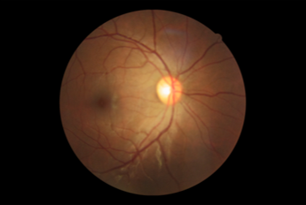
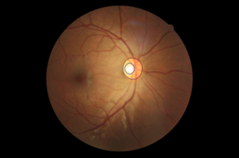
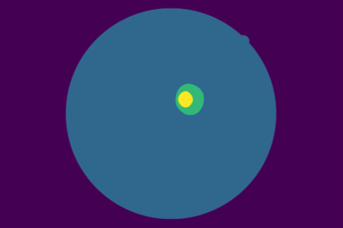
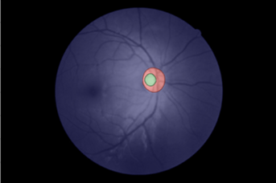

# Eye-Fundus-Image-Segmentation

Python implementation of bacgkround, fundus, disc and cup segmention on fundus images based on conventional image processing methods.

## Approach: 
This approach is based on morphological operations.
Detailed explanations are made in segmentation_algorithm.pdf.
In this projects we had 6 different annotations for each BinRushed fundus images.

The segmentation algorithm can be run via:
```Python
python seg_main.py
```
After images are segmented, original images along with their different segmentations are saved as hdf5 files.

### Results (Image from [BinRushed](https://deepblue.lib.umich.edu/data/concern/data_sets/3b591905z) database)
Original image:



Image annotated by a clinician:



Result of the segmentation algorithm:



Overlaid image of segmentation and annotation:



## Postprocessing:
Segmented images can be further processed (i.e: rescaling, normalizing, etc.) via: 
```Python
python seg_postprocessing.py
```
## Dataset
Fundus images can be found in [Deep Blue Data](https://deepblue.lib.umich.edu/data/concern/data_sets/3b591905z).